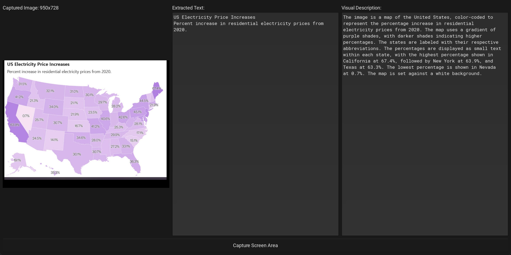

# Vision Explorer

Capture any area of your screen and get instant text extraction and visual descriptions using local, privacy-focused multimodal language models with Ollama.



## Features

- **Screen Area Capture**: A simple, intuitive tool to select any portion of your screen.
- **Local AI Processing**: Leverages [Ollama](httpsa://ollama.com/) to run powerful multimodal models (like LLaVA or Qwen-VL) locally on your machine. Your data never leaves your computer.
- **Two-Pass Analysis**:
- **Responsive UI**: Built with Kivy, the user interface remains responsive while the AI processes the image in the background.
- **Side-by-Side View**: Immediately compare the original captured image with the extracted text and the AI-generated visual description.
- **Configurable**: Easily change the Ollama endpoint, model, and other settings via a simple `config.json` file.

## Requirements

- Python 3.8+
- An active Ollama instance running a multimodal model.

**Recommended Models:**
- `qwen2.5vl:3b` (used in development)


You can pull a model by running:
```sh
ollama pull qwen2.5vl:3b
```

## Installation

1.  **Clone the repository:**
    ```sh
    git clone <your-repo-url>
    cd VisionExplorer
    ```

2.  **Install the required Python packages:**

    It's recommended to use a virtual environment:
    ```sh
    python -m venv venv
    source venv/bin/activate  # On Windows, use `venv\Scripts\activate`
    ```

    Install dependencies from `requirements.txt`:
    ```sh
    pip install -r requirements.txt
    ```
    *(If a `requirements.txt` is not available, you can install the packages manually: `pip install kivy Pillow requests ollama`)*

## Usage

1.  Ensure your Ollama application is running in the background.
2.  Run the Vision Explorer application:
    ```sh
    python main.py
    ```
3.  The application will launch with a screen capture overlay.
4.  Click and drag to select the desired area of your screen.
5.  Release the mouse to confirm the selection. The main window will appear.
6.  The application will show a "Processing..." status. Once the Ollama model responds, the "Extracted Text" and "Visual Description" columns will be populated.
7.  Click the "Capture Screen Area" button to start a new capture.

To cancel a capture, press the `ESC` key.

## License

This project is open-source and available under the MIT License.